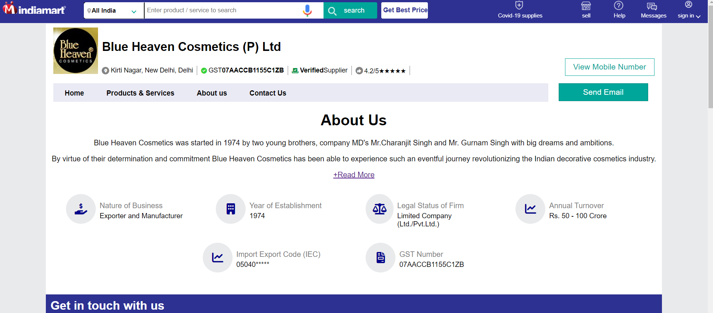
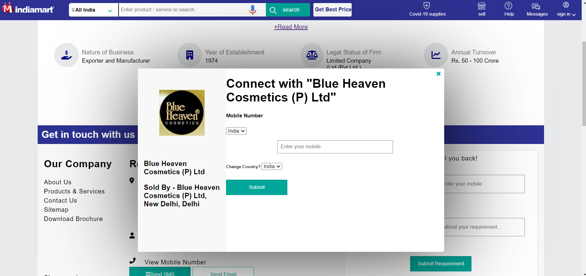
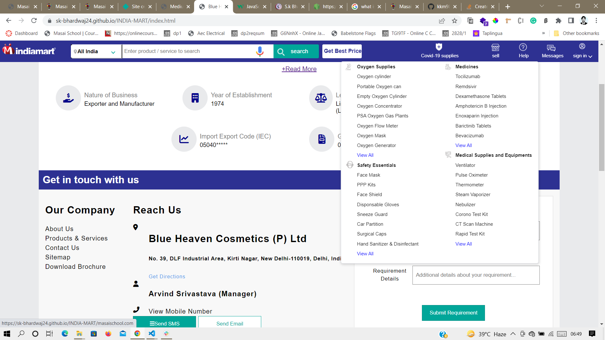
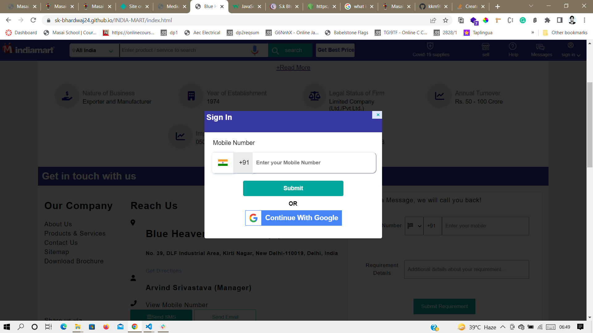
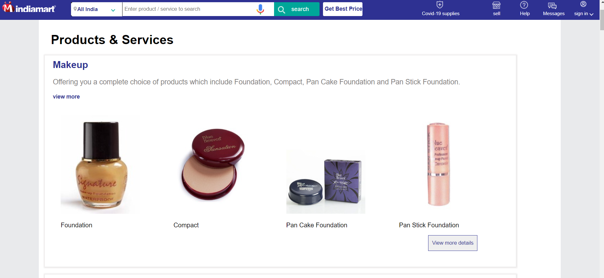
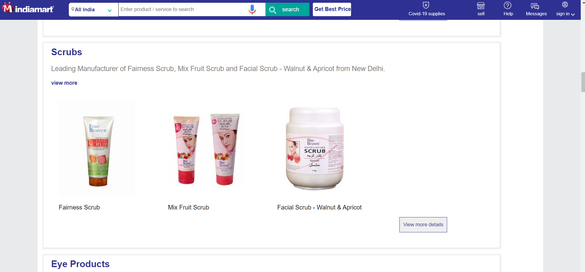

## <h1 align="center">IndiaMart</h1>

 

<h4>WE worked on IndiaMart clone IndiaMart clone script is an open source online B2B marketplace connecting numerous buyers with sellers across the globe. It is helping various suppliers which offers a wide range of products such as led lights, electronics & electrical, tower fans, biometric systems, industrial machinery, water treatment & purifying systems, bakery ovens, pizza ovens, industrial supplies, computer & office accessories etc</h4>

<!-- 
 
 -->

<h1>Team(3 Members)</h1>
<ul color="blue">
<li >Saurabh Kumar Bhardwaj</li>
<li>HewaliGogoi</li>
<li>VENKATESH K P</li>
</ul>

 

<h1>Tech Stack </h1>
<ul color="blue">
<li>Front-end:HTML,CSS, JavaScript</li>

<li>Resources used in this project:FontIcon</li>
</ul>
<h1>Webpages along with its features</h1>

<h2 align="center">Landingpage & Navbar</h2>
     <h4>User can Know about IndiaMart</h4>
     <h4>Dropdown menu on hover</h4>
     <h4>In left side there is Sign Popup user can sign in from there they also can choose their country-code</h4>
     <h4> After Sign-in user will redirected to Homepage</h4>

 
  
   
    

 

<h2 align="center">Product & service</h2>
    <h4>Here user can see the product and can send their requirement</h4>
      <!--  -->
      <!--  -->

   
    
